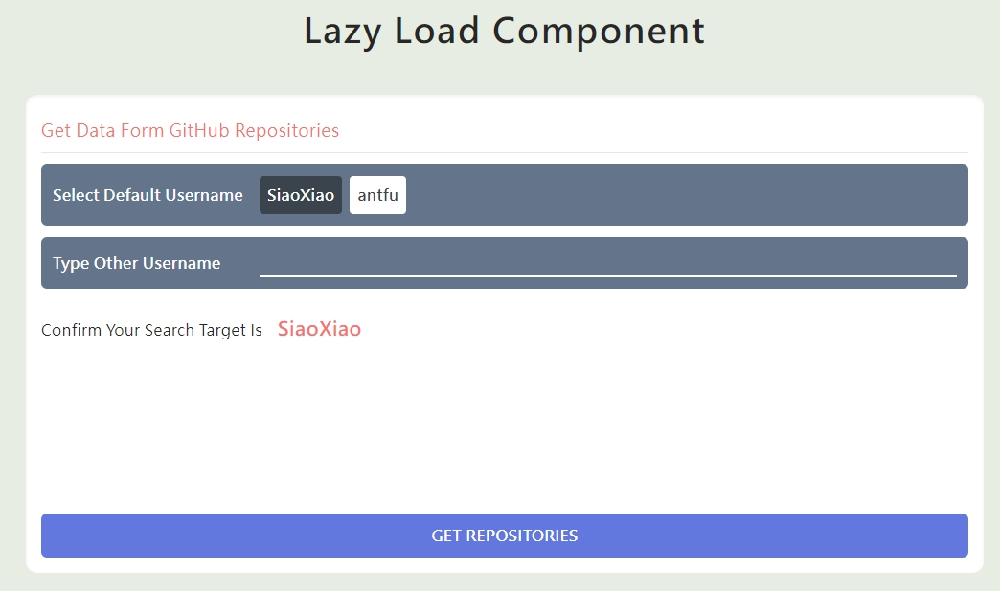

<h1 align="center">Lazy Load懶加載</h1>

  
  
  
  
  

<h2>
<a href="https://side-project-lazy-load.vercel.app/">
 demo here
</a>
</h2>

## 📄 Description

This project uses Vite as the build tool, Vue3 as the front-end framework, and TailwindCSS as the CSS framework to create an Lazy Load page. Through this project, developers can learn how to use Vue3 and TailwindCSS to quickly build web applications with a professional look and feel.

## 📋 Project Structure

1. Home page: show the Lazy Load.

## 🚀 Features

- The page is developed with Vue.js framework.
- The page is use Tailwind CSS framework.
- Build tool use Vite.
- There is no database required.

## 📦 Setup & Development Server

1. Run `npm i` or `npm install` to install the Node.js dependencies.
2. Run `npm run dev` to run server. Server is listening on localhost:3000.
3. Open `http://localhost:8080/` in your browser.

## 📦 API & image

1. Image: https://picsum.photos/
2. API: https://jsonplaceholder.typicode.com/

